# Fiche de mise en service — Poste de travail cabinet comptable

**Projet 1 — PPE IT Essentials (module CFC 187)**
**Classe :** E1B · **Établissement :** Geneva Institute of Technology
**Technicien :** Paul Giocanti · **Date d'intervention :** 14.09.2026

---

## 1. Contexte de la mission

Un cabinet comptable genevois de 3 collaborateurs engage un technicien externe pour mettre en service le poste de travail d'une nouvelle collaboratrice. Le poste doit être **prêt à l'emploi le lundi matin** : session ouverte au nom de l'utilisatrice, logiciels bureautiques fonctionnels, accès à l'imprimante du bureau, et protections de base actives.

Le cabinet ne dispose ni de serveur d'annuaire, ni de service informatique interne. Toutes les décisions techniques de cette fiche sont prises dans ce cadre : **simplicité d'exploitation, coût nul en licences, et autonomie de l'utilisatrice au quotidien.**

### Périmètre

| Inclus | Exclu |
|---|---|
| Installation et configuration du poste `COMPTA-PG` | Migration de données depuis un ancien poste |
| Création des comptes et politique de mot de passe | Sauvegarde automatisée (à prévoir, voir §9) |
| Raccordement à l'imprimante réseau existante | Installation ou configuration de l'imprimante elle-même |
| Mesures de sécurité de base | Licence Windows définitive (voir §9) |

---

## 2. Équipements concernés

| Rôle | Nom | Adresse IP | Système | Statut |
|---|---|---|---|---|
| Poste de travail livré | `COMPTA-PG` | `192.168.190.20` | Windows 11 Pro 24H2 (build 26100) | **Livré ce jour** |
| Serveur d'impression | `pc02-pg` | `192.168.190.10` | Ubuntu 26.04 LTS + CUPS | Infrastructure existante |
| Passerelle / DNS | — | `192.168.190.2` | — | Infrastructure existante |

### Schéma du réseau du cabinet

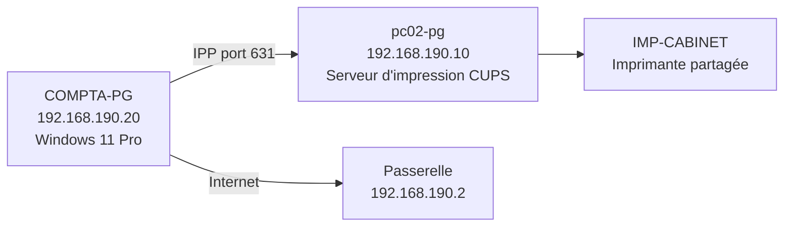
```mermaid
graph LR
    A["COMPTA-PG<br/>192.168.190.20<br/>Windows 11 Pro"] -->|IPP port 631| B["pc02-pg<br/>192.168.190.10<br/>Serveur d'impression CUPS"]
    A -->|Internet| C["Passerelle<br/>192.168.190.2"]
    B --> D["IMP-CABINET<br/>Imprimante partagée"]
```

Le réseau est en `192.168.190.0/24` (masque `255.255.255.0`), soit 254 adresses utilisables — largement suffisant pour un cabinet de 3 personnes.

**Plan d'adressage retenu :**

| Plage | Usage |
|---|---|
| `.1` – `.9` | Équipements réseau (passerelle, etc.) |
| `.10` – `.99` | **Adresses fixes** : serveurs, imprimantes, postes fixes |
| `.128` – `.254` | **Plage DHCP** : portables, téléphones, visiteurs |

> **Pourquoi ce découpage :** une adresse fixe posée à l'intérieur de la plage distribuée automatiquement finit tôt ou tard par entrer en conflit avec un appareil qui reçoit la même adresse — et le poste concerné perd le réseau, souvent le pire jour possible. Séparer les deux zones élimine le problème à la source et rend le plan d'adressage lisible pour le prochain technicien.

---

## 3. Configuration matérielle

| Composant | Valeur |
|---|---|
| Processeur | 4 cœurs virtuels |
| Mémoire vive | 6 Go |
| Stockage | 60 Go, disque NVMe |
| Firmware | **UEFI** avec démarrage sécurisé activé |
| Puce de sécurité | **TPM 2.0** présent |
| Carte réseau | Ethernet, mode NAT |

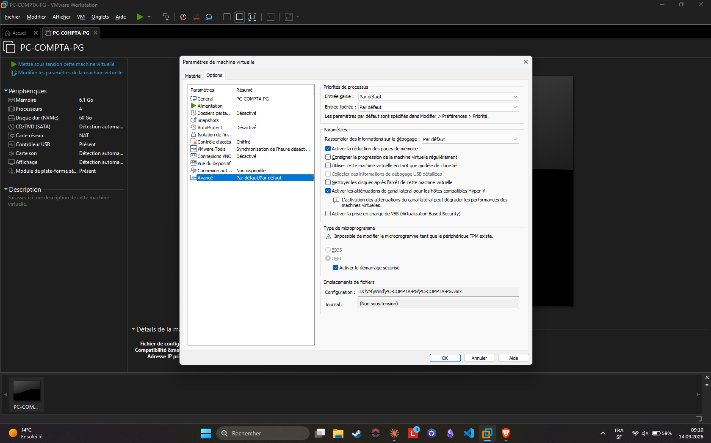

> **UEFI et démarrage sécurisé (Secure Boot) :** l'UEFI est le micro-logiciel qui démarre la machine, successeur de l'ancien BIOS. Le démarrage sécurisé lui permet de refuser tout système non signé numériquement, ce qui bloque une famille entière d'attaques où un programme malveillant se charge **avant** Windows et devient donc invisible à l'antivirus. Ces deux réglages, plus la puce TPM, sont exigés par Windows 11 — mais leur intérêt reste le même sur n'importe quel poste professionnel.

---

## 4. Système d'exploitation

| Élément | Valeur |
|---|---|
| Système | Windows 11 Professionnel, version 24H2 |
| Build | 10.0.26100 |
| Partitionnement | GPT (conséquence de l'installation UEFI) |
| Langue d'interface | Français |
| Format horaire et monétaire | **Français (Suisse)** |
| Disposition du clavier | **Suisse romand** |
| Source d'installation | Support fourni par l'établissement |

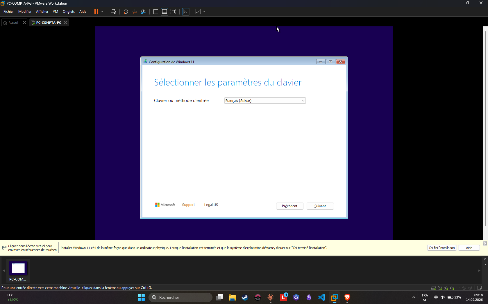

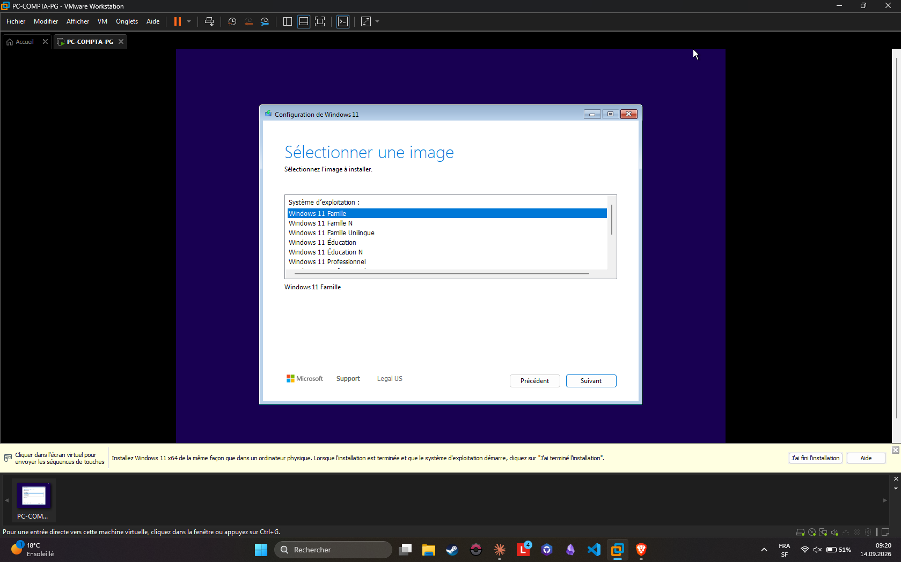

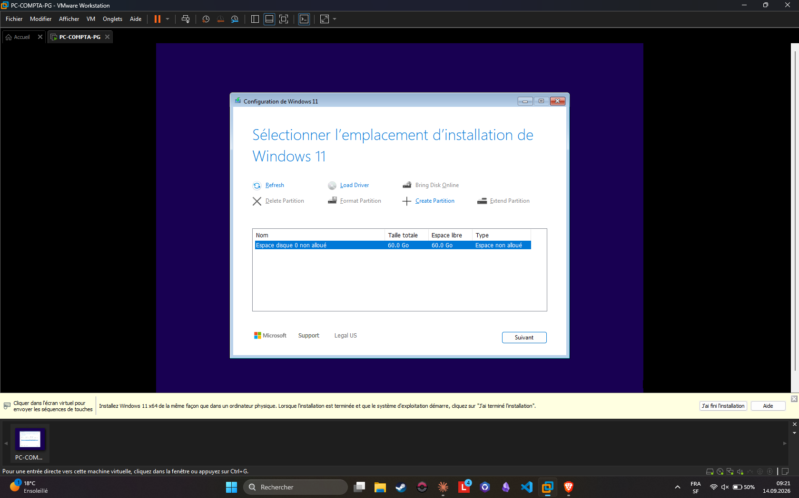

> **Pourquoi l'édition Professionnel et non Famille :** seule l'édition Pro permet de configurer un groupe de travail correctement, d'appliquer des stratégies de sécurité locales et d'activer le chiffrement BitLocker. Pour un poste qui traite des données comptables de clients, c'est le minimum.

> **Pourquoi le format régional suisse :** ce réglage détermine la façon dont Windows — et par conséquent le tableur et le logiciel de comptabilité — affiche les montants et les dates. En Suisse : `1'250.50` et `14.09.2026`. En français de France : `1 250,50` et `14/09/2026`. Pour une comptable, une erreur de séparateur décimal se propage dans tous les fichiers et fausse les totaux. Le clavier « Suisse romand » correspond quant à lui aux touches réellement gravées sur les claviers vendus dans la région.

---

## 5. Comptes utilisateurs

| Compte | Type | Usage |
|---|---|---|
| `adm.pg` | **Administrateur local** | Maintenance, installation de logiciels, interventions du technicien |
| `c.rossier` | **Utilisateur standard** | Session de travail quotidienne de la collaboratrice |

### Politique de mot de passe appliquée

| Paramètre | Valeur | Commande utilisée |
|---|---|---|
| Longueur minimale | 10 caractères | `net accounts /minpwlen:10` |
| Verrouillage du compte | après 5 échecs | `net accounts /lockoutthreshold:5` |

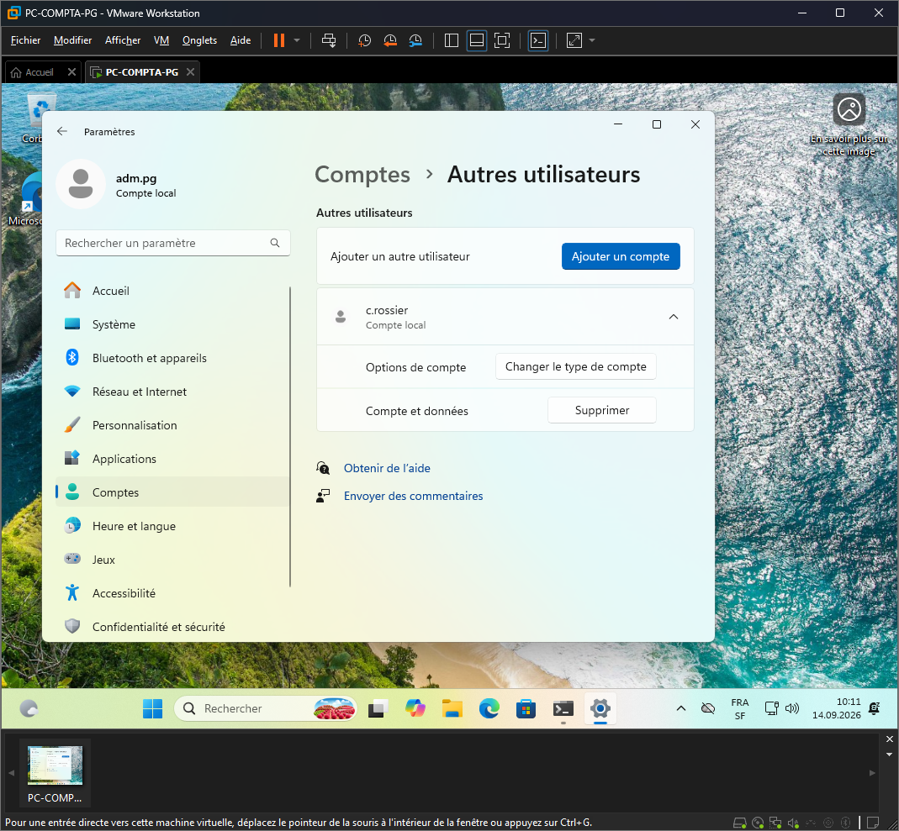

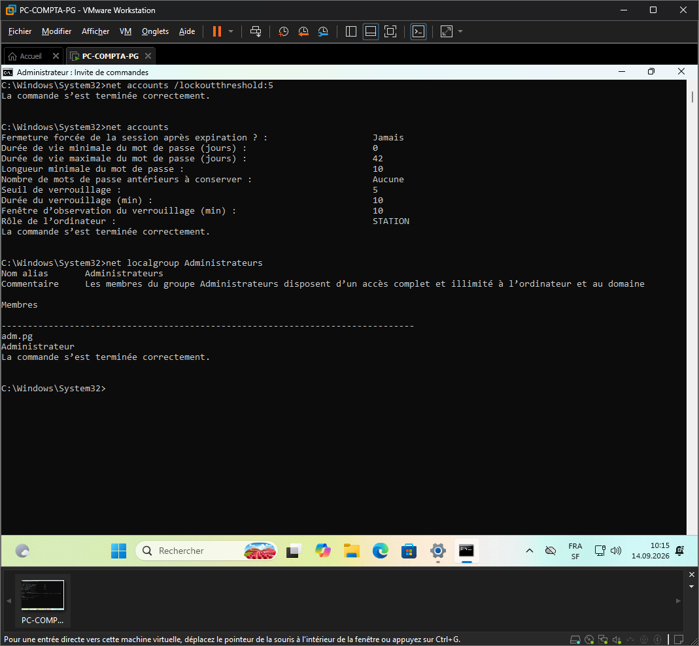

> **Le point central de cette configuration :** la collaboratrice travaille avec un compte **sans droits d'administration**. C'est la mesure de sécurité la plus rentable d'un poste bureautique. Un logiciel malveillant ouvert depuis une pièce jointe s'exécute avec les droits de la session : depuis un compte standard, il ne peut pas s'installer dans le système, ni modifier les autres comptes, ni désactiver l'antivirus. Il reste confiné aux fichiers de l'utilisatrice — ce qui est déjà sérieux, mais reste récupérable.

> **Le verrouillage après 5 échecs** rend inopérante une attaque par force brute, où un outil automatisé teste des milliers de mots de passe à la suite. Sans ce garde-fou, la longueur du mot de passe ne protège que contre un humain, pas contre une machine.

---

## 6. Configuration réseau

| Paramètre | Valeur |
|---|---|
| Nom du poste | `COMPTA-PG` |
| Groupe de travail | `CABINET` |
| Adresse IP | `192.168.190.20` (**fixe**) |
| Masque de sous-réseau | `255.255.255.0` |
| Passerelle par défaut | `192.168.190.2` |
| DNS préféré / auxiliaire | `192.168.190.2` / `8.8.8.8` |

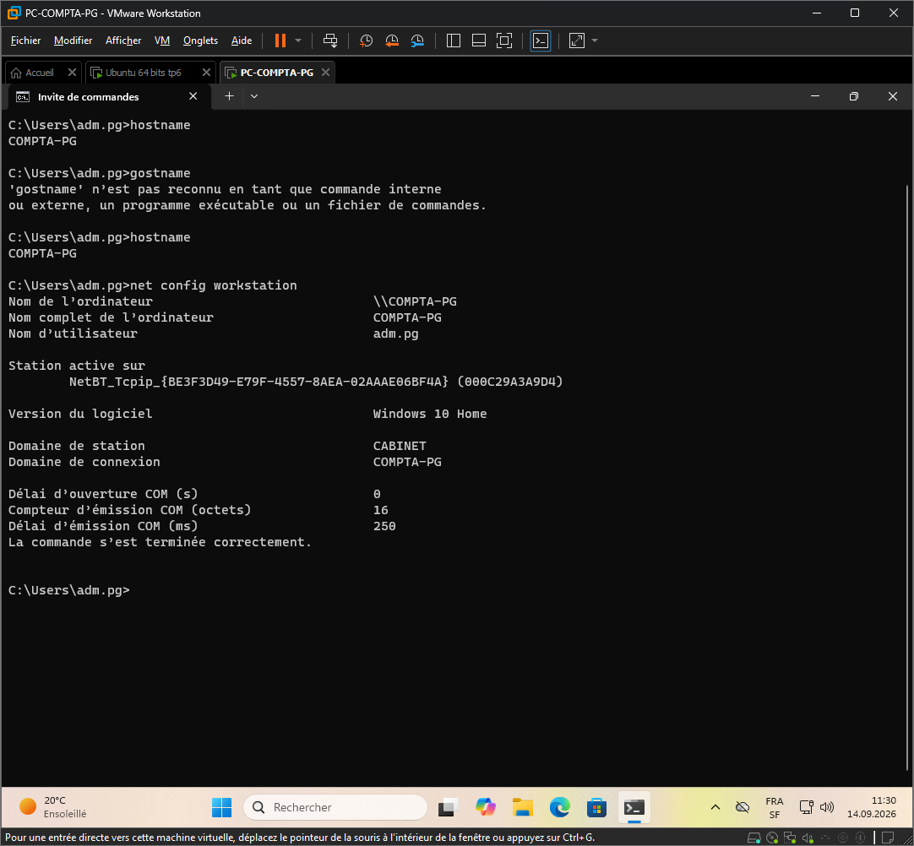

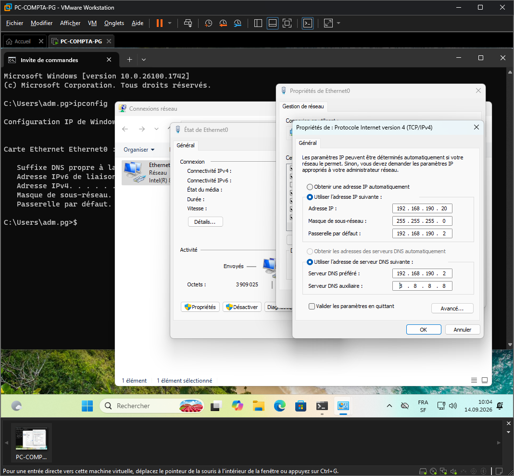

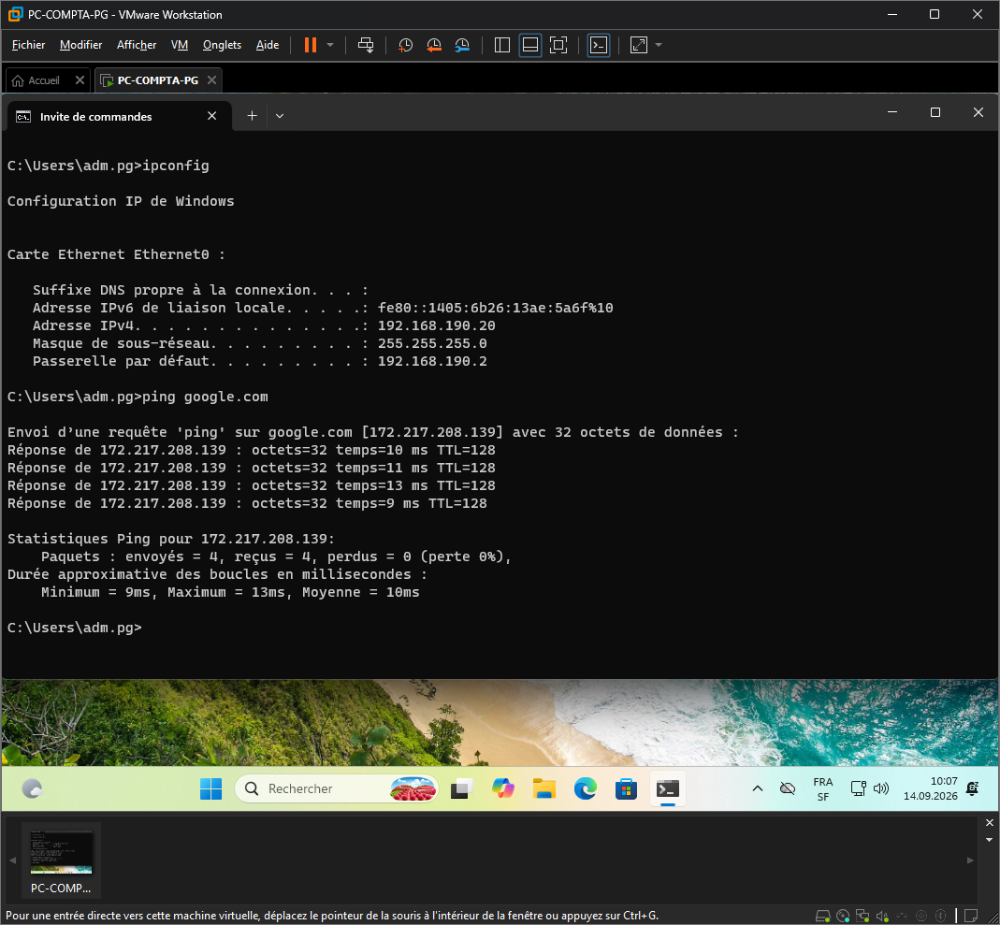

> **Groupe de travail plutôt que domaine :** un domaine Active Directory suppose un serveur dédié, sa licence, sa sauvegarde et son entretien. Pour trois personnes, c'est injustifiable. Le groupe de travail `CABINET` suffit à ce que les postes se voient entre eux et partagent fichiers et imprimante. Le nom a été choisi en référence au client plutôt que de laisser `WORKGROUP` par défaut : un parc où toutes les valeurs d'usine ont été conservées ne se documente pas et ne se dépanne pas.

> **Adresse fixe plutôt que DHCP :** ce poste consomme un service réseau (l'imprimante) et peut à terme partager des dossiers. Une adresse stable évite que l'imprimante « disparaisse » après une coupure de courant ou un redémarrage du routeur.

> **Deux serveurs DNS :** le DNS traduit les noms de sites en adresses IP. Le premier serveur est celui du réseau local ; le second (`8.8.8.8`, serveur public de Google) prend le relais si le premier ne répond plus. Sans DNS, tout fonctionne « techniquement » mais aucun site ne s'ouvre et les mises à jour échouent — c'est une panne classique, déroutante pour un utilisateur car le réseau paraît actif.

---

## 7. Logiciels métier

Installation réalisée avec **winget**, le gestionnaire de paquets intégré à Windows 11. Un script unique installe la totalité du pack et génère un rapport d'inventaire, ce qui rend l'opération reproductible à l'identique sur les deux autres postes du cabinet.

| Logiciel | Justification métier |
|---|---|
| **LibreOffice** | Suite bureautique complète, lit et écrit les formats `.xlsx` et `.docx`. Coût nul en licences. |
| **Adobe Acrobat Reader** | Lecture des factures, relevés bancaires et déclarations fiscales — le format de travail dominant du métier. |
| **Mozilla Firefox** | Accès aux logiciels de comptabilité en ligne, à l'e-banking et aux portails administratifs. |
| **7-Zip** | Ouverture des archives `.zip` / `.7z` dans lesquelles les clients transmettent leurs pièces comptables. |
| **Mozilla Thunderbird** | Client de messagerie local du cabinet. |
| **Crésus** | Logiciel de comptabilité de référence en Suisse romande — plan comptable suisse, TVA suisse, exports conformes aux exigences fiscales cantonales. Installé manuellement (non distribué par winget). |

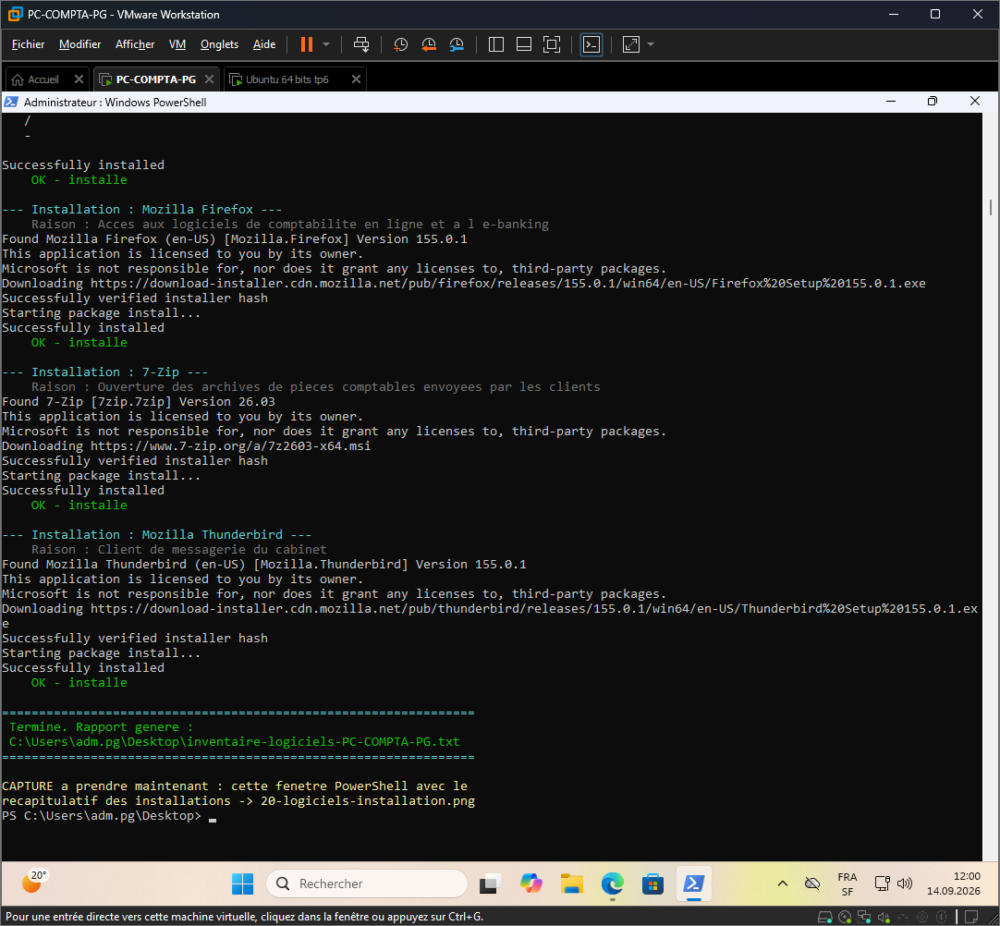

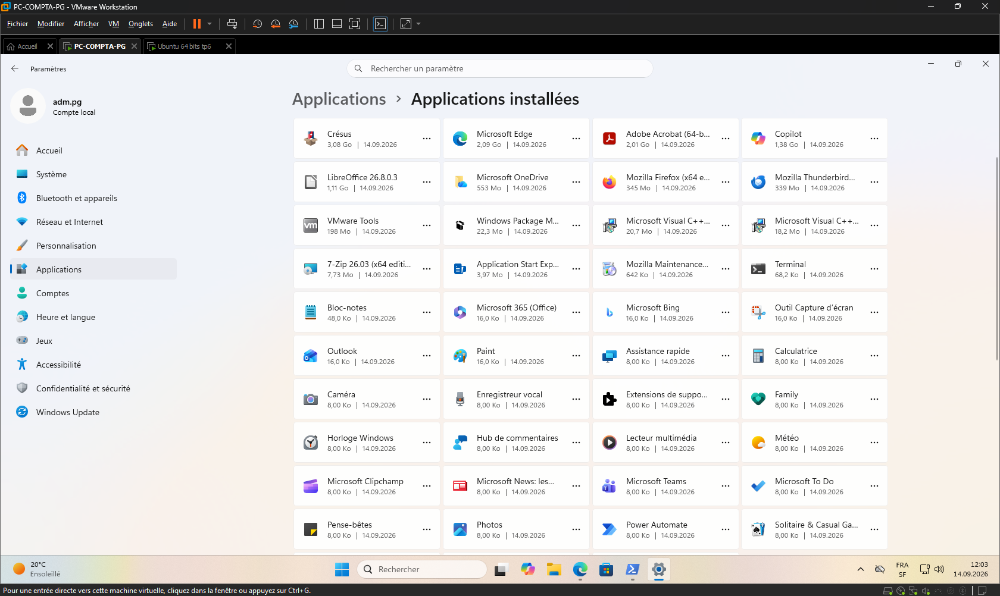

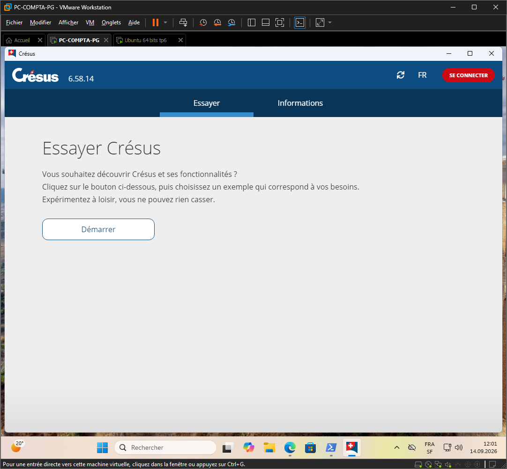

**Inventaire détaillé :** voir le fichier `inventaire-logiciels-PC-COMPTA-PG.txt` en annexe, généré automatiquement par le script d'installation (versions exactes de chaque logiciel au jour de la livraison).

> **Sur le choix de Crésus :** un cabinet comptable genevois ne travaille pas avec un logiciel de comptabilité générique. Crésus (éditeur Epsitec, Suisse) applique le plan comptable suisse, gère la TVA selon les règles fédérales et produit des exports acceptés par les administrations cantonales. Installer un logiciel de comptabilité français ou américain sur ce poste obligerait la collaboratrice à retraiter manuellement chaque déclaration.

> **Sur le choix de LibreOffice :** Microsoft 365 reste la référence du marché et s'impose si le cabinet échange des fichiers Excel à formules complexes avec des tiers. LibreOffice a été retenu ici parce que le client n'a pas exprimé ce besoin et qu'aucune licence n'était disponible. Le point est signalé au §9 pour arbitrage par le client.

---

## 8. Imprimante réseau

| Paramètre | Valeur |
|---|---|
| Nom de la file d'impression | `IMP-CABINET` |
| Description | Imprimante partagée du cabinet comptable |
| Emplacement | Bureau principal |
| Serveur d'impression | `pc02-pg` — `192.168.190.10` |
| Protocole | **IPP** (Internet Printing Protocol), port 631 |
| Pilote côté poste | Microsoft IPP Class Driver |
| Découverte | Automatique (annonce mDNS/Bonjour du serveur) |

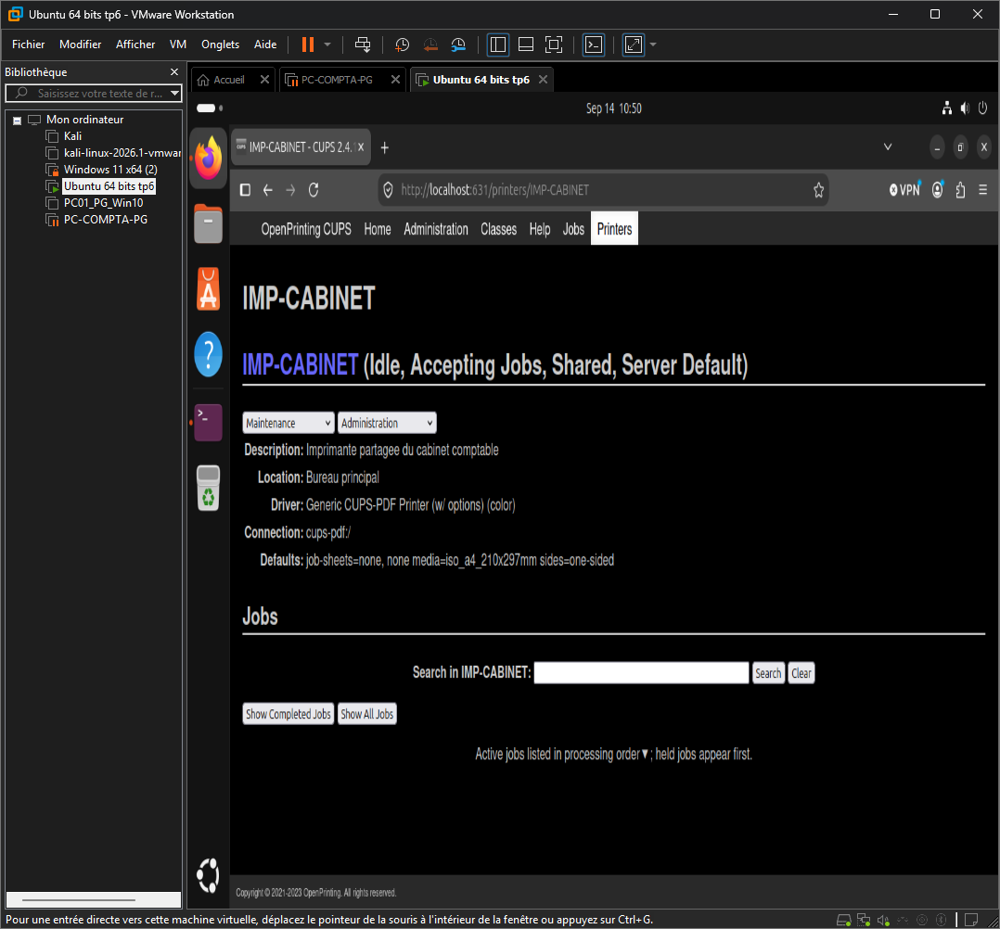

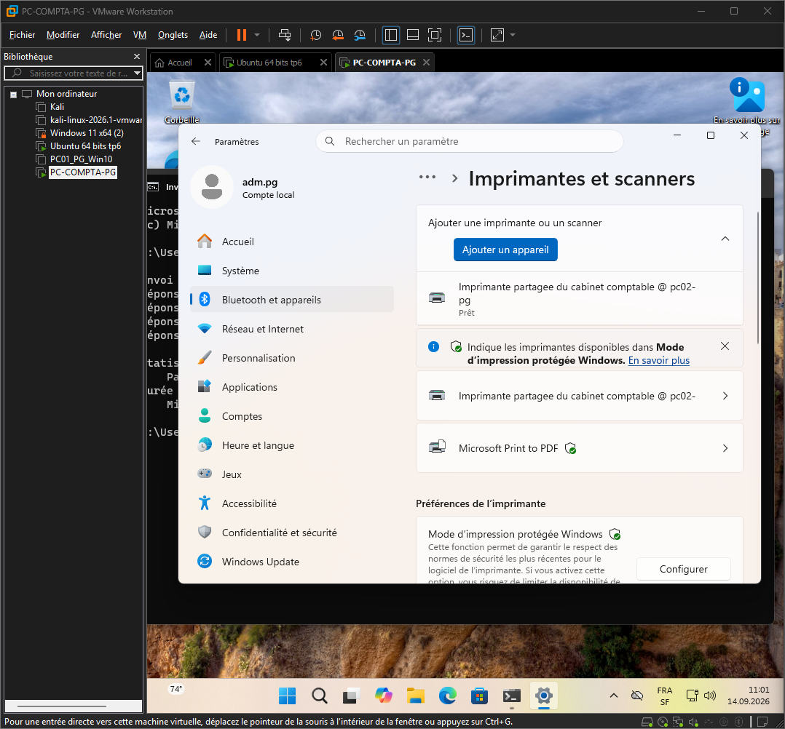

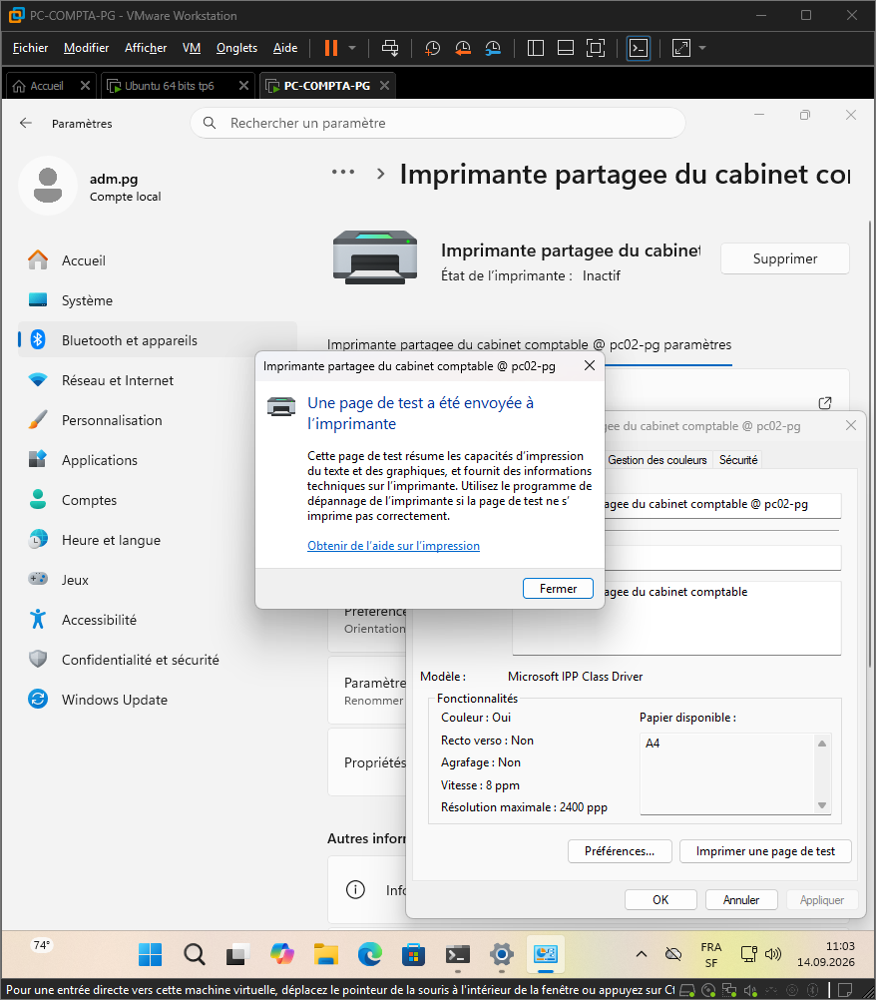

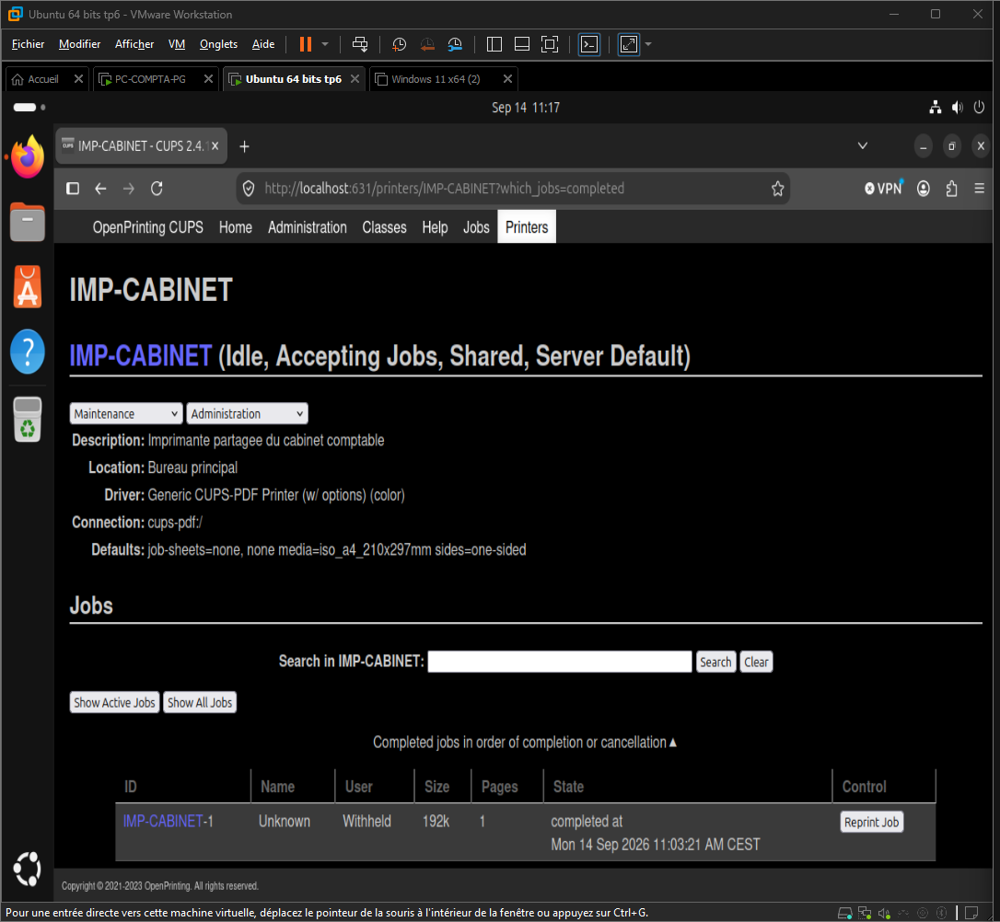

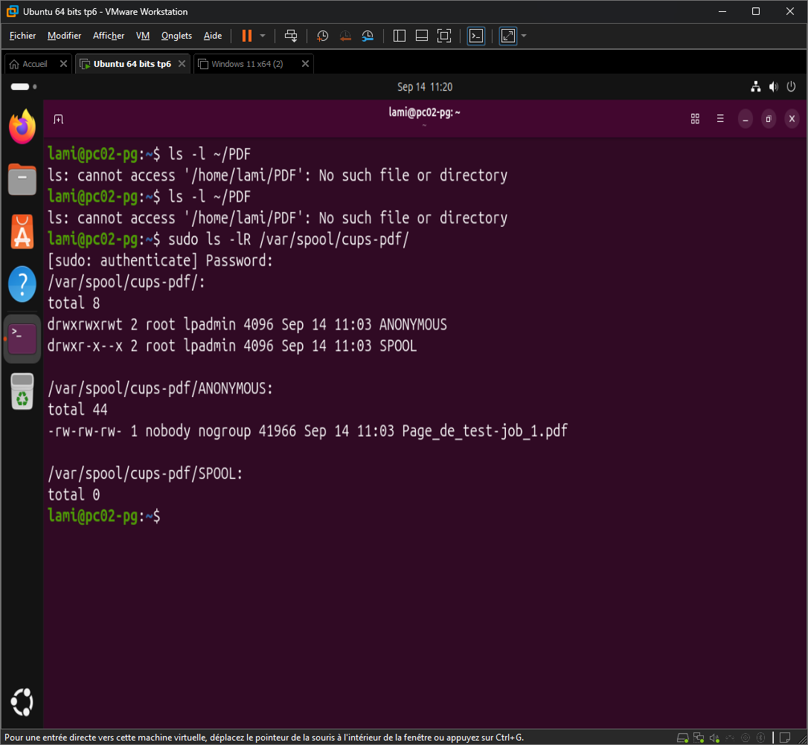

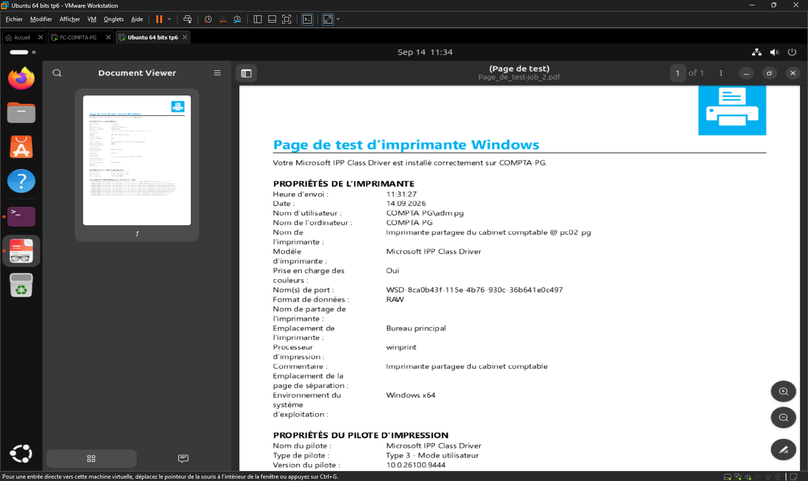

> **Comment fonctionne la chaîne :** le poste n'est pas relié directement à l'imprimante. Il envoie ses documents au serveur d'impression, qui tient la file d'attente et pilote le matériel. C'est l'architecture standard dès qu'une imprimante est partagée entre plusieurs postes : elle évite les conflits entre travaux simultanés, centralise les pilotes, et permet de remplacer l'imprimante physique sans reconfigurer chaque poste.

> **Le port 631 et le protocole IPP** sont le standard d'impression réseau, supporté nativement par Windows, macOS et Linux. Il a fallu l'autoriser explicitement dans le pare-feu du serveur (`ufw allow 631/tcp`) : un pare-feu bien réglé bloque tout par défaut et n'ouvre que ce qui est nécessaire, service par service.

**Validation :** une page de test a été envoyée depuis `COMPTA-PG`, reçue et traitée par le serveur (travail `IMP-CABINET-2`, état *completed*), et le document produit a été ouvert et vérifié. Il porte bien le nom du poste émetteur.

---

## 9. Mesures de sécurité

| Mesure | État | Détail |
|---|---|---|
| Mises à jour Windows | ✅ Actif | Poste à jour au 14.09.2026, mises à jour automatiques activées |
| Antivirus | ✅ Actif | Microsoft Defender, protection en temps réel |
| Pare-feu | ✅ Actif | Pare-feu Windows Defender, tous profils réseau |
| Protection du compte | ✅ Actif | Compte utilisateur sans droits d'administration |
| Politique de mot de passe | ✅ Appliquée | 10 caractères minimum, verrouillage après 5 échecs |

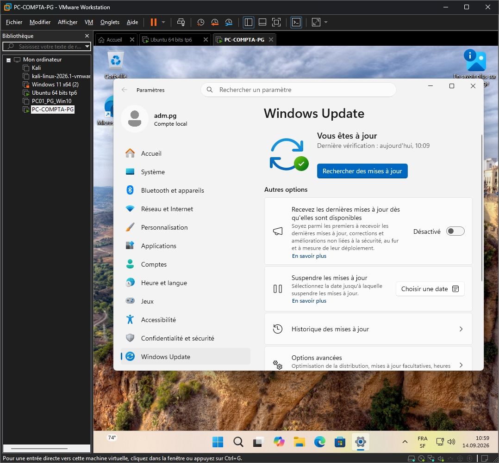

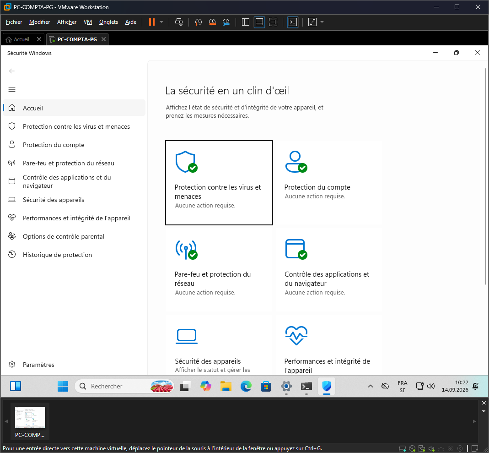

> **Pourquoi aucun antivirus tiers :** Microsoft Defender est intégré à Windows 11, activé par défaut, mis à jour par Windows Update et suffisant pour un poste bureautique. Faire acheter au client une licence antivirus supplémentaire sans besoin identifié serait une dépense injustifiée — et multiplier les antivirus sur une même machine dégrade les performances sans améliorer la protection.

> **Pourquoi la mise à jour complète avant livraison :** un poste installé depuis un support d'origine accuse plusieurs mois de retard sur les correctifs de sécurité. Livrer sans avoir appliqué les mises à jour revient à livrer un poste dont les failles connues sont publiquement documentées.

### Points à arbitrer par le client

| Point | Recommandation |
|---|---|
| **Licence Windows** | Le poste fonctionne sans clé d'activation mais affiche un filigrane. Une licence Windows 11 Pro doit être fournie par le client. |
| **Suite bureautique** | LibreOffice installé. Si le cabinet échange des classeurs Excel complexes avec des tiers, prévoir Microsoft 365. |
| **Sauvegarde** | Aucune sauvegarde automatique n'est en place. À définir avec le client (disque externe, NAS ou service cloud) — c'est le principal risque résiduel du poste. |
| **Chiffrement du disque** | BitLocker est disponible (TPM présent) mais non activé. Recommandé si le poste est amené à sortir des locaux. |
| **Licence Crésus** | Le logiciel est installé et fonctionnel. La licence définitive et la reprise du dossier comptable existant sont à organiser avec le client et son fiduciaire. |

---

## 10. Tests de validation

| # | Test | Résultat attendu | Statut |
|---|---|---|---|
| 1 | Démarrage et ouverture de session `c.rossier` | Session ouverte sans droits admin | ✅ |
| 2 | `hostname` | `COMPTA-PG` | ✅ |
| 3 | `net config workstation` | Groupe de travail `CABINET` | ✅ |
| 4 | `ipconfig` | `192.168.190.20` en adresse fixe | ✅ |
| 5 | `ping 192.168.190.2` | Réponse de la passerelle | ✅ |
| 6 | `ping google.com` | Résolution DNS et réponse | ✅ |
| 7 | `ping 192.168.190.10` | Réponse du serveur d'impression | ✅ |
| 8 | Ouverture de LibreOffice Calc | Application fonctionnelle | ✅ |
| 9 | Ouverture de Crésus | Application fonctionnelle | ✅ |
| 10 | Impression d'une page de test | Document reçu et produit par le serveur | ✅ |
| 11 | Sécurité Windows | Antivirus et pare-feu actifs | ✅ |
| 12 | Windows Update | « Vous êtes à jour » | ✅ |

---

## 11. Remise au client

**Le poste est opérationnel et prêt à l'emploi.**

À transmettre à la collaboratrice lors de la remise :

- Son identifiant de session : `c.rossier`
- Son mot de passe initial, avec consigne de le changer à la première connexion
- L'emplacement et le nom de l'imprimante : `IMP-CABINET`, bureau principal
- Le rappel qu'elle ne peut pas installer de logiciels elle-même — c'est volontaire, et toute demande passe par le technicien

À conserver par le responsable du cabinet :

- Les identifiants du compte `adm.pg` (compte de maintenance), dans un endroit sûr
- La présente fiche

---

## Annexes

| Annexe | Contenu |
|---|---|
| `captures/` | Captures d'écran de toutes les étapes clés (numérotées chronologiquement) |
| `inventaire-logiciels-PC-COMPTA-PG.txt` | Inventaire automatique des logiciels installés, avec versions |
| `install-logiciels-metier.ps1` | Script d'installation utilisé — reproductible sur les autres postes du cabinet |

---

*Fiche établie le 14.09.2026 par Paul Giocanti — PPE IT Essentials, module CFC 187, classe E1B, Geneva Institute of Technology.*
